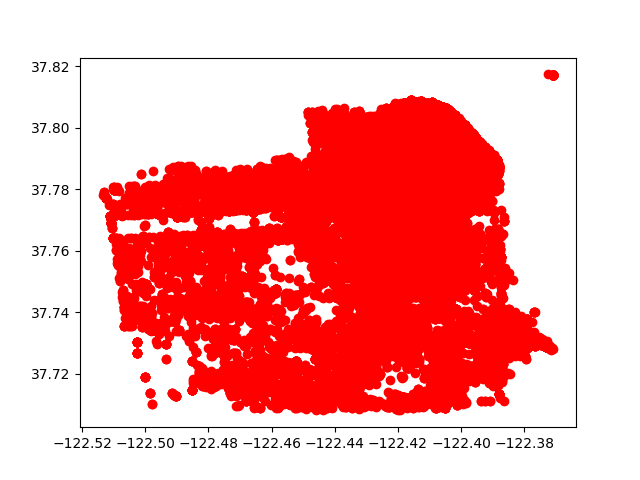
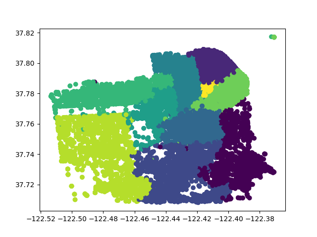

# Анализ данных о преступлениях в Сан-Франциско

## Описание
Этот проект предназначен для анализа данных о преступлениях, произошедших в Сан-Франциско за последние три месяца. Программа загружает данные из CSV-файла, проводит их предварительную обработку, анализирует и визуализирует результаты анализа. Целью проекта является предоставление статистического анализа распределения преступлений по категориям и районам, а также выявление определённых тенденций за указанный период.

## Функционал
- Загрузка и предварительная обработка данных из CSV-файла.
- Добавление новых столбцов в датафрейм для месяца и дня инцидента.
- Удаление ненужных столбцов для упрощения анализа.
- Вывод статистики по категориям и районам преступлений.
- Фильтрация данных для анализа преступлений, произошедших в определённый месяц или день.
- Визуализация распределения преступлений с использованием графиков и карт.
- Сохранение визуализированных данных в виде изображений и HTML-файлов.

## Зависимости
Для работы программы необходимы следующие библиотеки:
- `numpy`
- `pandas`
- `matplotlib`
- `folium`

## Установка и запуск проекта
1. Клонируйте репозиторий:
```
git clone https://github.com/Sogato/BDA-lab1.git
```
2. Создайте виртуальное окружение:
```
python -m venv env
```
3. Установите зависимости проекта:
```
pip install -r requirements.txt
```
4. Запустите программу:
```
python manage.py runserver
```

## Пример использования
После запуска программы вы увидите в консоли статистический анализ данных, а также в директории проекта будут сохранены следующие файлы:
- `plot.png` и `scatter_plot.png` — изображения, показывающие распределение преступлений по координатам и районам соответственно.
- `sf_crime_map.html` — интерактивная карта Сан-Франциско с метками преступлений.

## Визуализация результатов

В процессе анализа были созданы визуализации, демонстрирующие различные аспекты данных о преступлениях в Сан-Франциско. Ниже представлены примеры графиков, полученных в результате:

### Распределение преступлений по координатам


Этот график показывает распределение преступлений в городе по их географическим координатам. Каждая точка на графике соответствует месту происшествия.

### Распределение преступлений по районам


На этом графике изображено распределение преступлений по районам Сан-Франциско. Цвета точек соответствуют различным районам, что помогает визуально оценить, в каких частях города преступность выше.

### Интерактивная карта преступлений


Файл `sf_crime_map.html` содержит интерактивную карту, на которой отмечены места происшествий. Карта позволяет подробно изучить географическое распределение преступлений и идентифицировать потенциальные "горячие точки".

---

Подготовлено в рамках учебного проекта. Все данные взяты из открытых источников и использованы исключительно в образовательных целях.